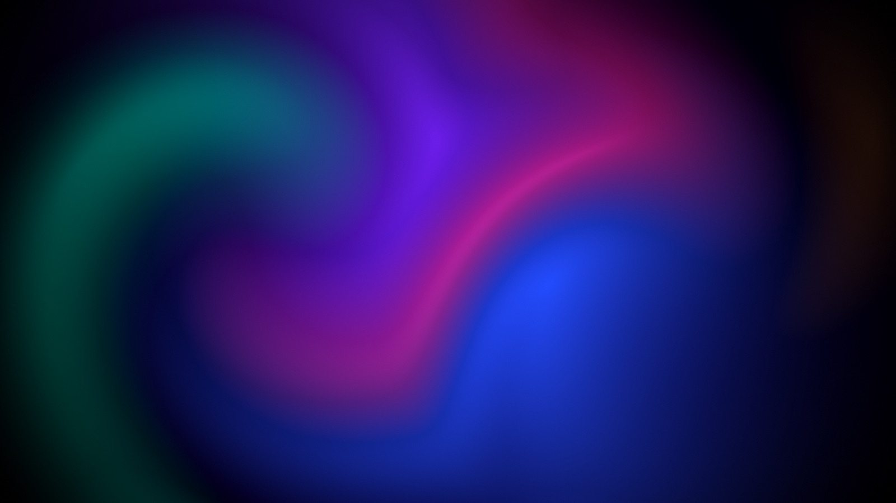

<p align="center">
  
</p>

<h1 align="center">Tidewall</h1>

<p align="center">
  Live, looping video wallpapers for macOS. Turn any video or GIF into a moving desktop.
</p>

<p align="center">
  <a href="https://github.com/TheBEACONFoundation/Tidewall/actions/workflows/ci.yml"></a>
  
  
  <a href="LICENSE"></a>
</p>

<p align="center">
  
</p>

Tidewall is a native SwiftUI + AppKit app in the spirit of Wallpaper Engine. Import a video, trim the part that loops, frame it, color-grade it, and set it as your desktop. It stays out of the way: hardware-decoded playback, click-through windows beneath your desktop icons, and automatic pausing whenever nobody can see it.

## Features

- **Any video or GIF**: MP4, MOV and M4V (H.264, HEVC, ProRes). Animated GIF, PNG, WebP and HEICS files are converted to H.264 on import.
- **Loop editor** with a live preview framed like your display:
  - Filmstrip trimming with draggable in/out points and frame-accurate scrubbing
  - Fill, fit or stretch, plus zoom, position, mirroring and a background color
  - Playback speed from 0.25× to 2×
  - Brightness, contrast, saturation, hue, blur, vignette and tint
  - Optional audio
- **Live edits**: changes save automatically and update the desktop as you drag the sliders.
- **Multiple displays**: a different wallpaper on each screen, set from a to-scale map of your display arrangement. Screens showing the same wallpaper share one decoder.
- **Menu bar switcher** with thumbnails and pause/resume (⌥⌘P).
- **Easy on the battery**: pauses when full-screen apps or windows cover the desktop, and while the screen is locked, asleep or showing a screen saver. It can also pause in Low Power Mode or on battery. It never keeps the display awake.
- **Matching still** (optional): sets the macOS desktop picture to the loop's first frame, so Mission Control, the lock screen and the desktop after quitting all match.
- Open at login, and an optional Dock icon.

## Install

Download the latest **Tidewall-x.y.z.dmg** from [Releases](https://github.com/TheBEACONFoundation/Tidewall/releases), open it, and drag Tidewall to Applications.

Release builds are not notarized unless the release notes say otherwise, so macOS will block the first launch. To allow it, open **System Settings → Privacy & Security** and click **Open Anyway** next to Tidewall. Or run:

```bash
xattr -dr com.apple.quarantine /Applications/Tidewall.app
```

Requires macOS 15 Sequoia or later, on Apple silicon or Intel.

## Usage

1. Open Tidewall. The **Aurora** sample is already in your library.
2. Drag videos or GIFs into the window, or press **⌘O**.
3. Hover a wallpaper and click **Set**, or double-click it to open the editor.
4. In the editor, drag the yellow handles to choose the loop. Then adjust the framing and look in the right-hand panel.
5. Use the menu bar icon to switch wallpapers or pause them. Use **Displays** in the sidebar to give each screen its own wallpaper.

Tip: HEVC (H.265) videos use the least power. Clips that start and end on similar frames loop most smoothly.

## Build from source

Requires Xcode 26 or later. SwiftUI's macros ship with Xcode, not the standalone Command Line Tools.

```bash
git clone https://github.com/TheBEACONFoundation/Tidewall.git
cd Tidewall
swift test                      # unit + playback tests
Scripts/build-app.sh            # → build/Tidewall.app (universal, ad-hoc signed)
open build/Tidewall.app
```

For quick iteration, `Scripts/build-app.sh debug` builds for your Mac's architecture only. You can also open `Package.swift` in Xcode. Because the app needs its bundle's Info.plist and resources, run it through the build script.

### Distribution builds

`Scripts/package.sh` builds `dist/Tidewall-<version>.dmg`, a `.zip` and `SHA256SUMS.txt`. The version comes from the latest `v*` git tag. To produce a signed and notarized build, set these first:

```bash
export SIGN_IDENTITY="Developer ID Application: Your Name (TEAMID)"
export NOTARY_PROFILE="tidewall"   # from: xcrun notarytool store-credentials tidewall …
Scripts/package.sh
```

Pushing a tag like `v1.1.0` runs the [Release workflow](.github/workflows/release.yml), which tests, packages and publishes a GitHub Release. If the signing secrets listed at the top of that workflow are configured, it signs and notarizes too.

## How it works

| Piece | Where |
| --- | --- |
| Borderless, click-through window at `kCGDesktopWindowLevel` on every Space: above the system wallpaper, below desktop icons | [`Engine/DesktopWindow.swift`](Sources/Tidewall/Engine/DesktopWindow.swift) |
| `AVQueuePlayer` + `AVPlayerLooper` for gapless loops of a trimmed range. A Core Image `AVVideoComposition` is installed only while an adjustment is active. | [`Engine/LoopingPlayer.swift`](Sources/Tidewall/Engine/LoopingPlayer.swift) |
| Keeps windows and players in sync with displays, assignments, occlusion, sleep/lock and power state | [`Engine/WallpaperEngine.swift`](Sources/Tidewall/Engine/WallpaperEngine.swift) |
| Framing and filter math shared by the desktop, thumbnails and stills | [`Engine/FramePipeline.swift`](Sources/Tidewall/Engine/FramePipeline.swift) |
| Library storage, import and GIF → H.264 conversion | [`Model/`](Sources/Tidewall/Model) |
| Library window, editor, displays, menu bar, settings | [`Views/`](Sources/Tidewall/Views) |

Your library lives in `~/Library/Application Support/Tidewall`. Deleting a wallpaper moves its video to the Trash. Preferences and display assignments are stored in the `io.github.thebeaconfoundation.Tidewall` defaults domain.

The app icon and the Aurora sample are generated by [`Scripts/make-icon.swift`](Scripts/make-icon.swift) and [`Scripts/make-sample.swift`](Scripts/make-sample.swift). The sample is a 20-second loop in which every motion is periodic, so it repeats seamlessly.

## Limitations

- WebM and MKV aren't supported, because AVFoundation can't play them. Convert them to MP4 or MOV first.
- Wallpapers are videos only; interactive, web or shader scenes are not supported.
- macOS's own wallpaper still appears in Mission Control unless **Match the macOS wallpaper** is enabled.

## Contributing

Issues and pull requests are welcome. See [CONTRIBUTING.md](CONTRIBUTING.md).

## License

Copyright © 2026 Dominic Acosta.

Tidewall is free software: you can redistribute it and/or modify it under the terms of the [GNU General Public License v3.0](LICENSE) as published by the Free Software Foundation.
