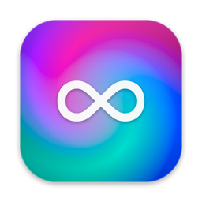
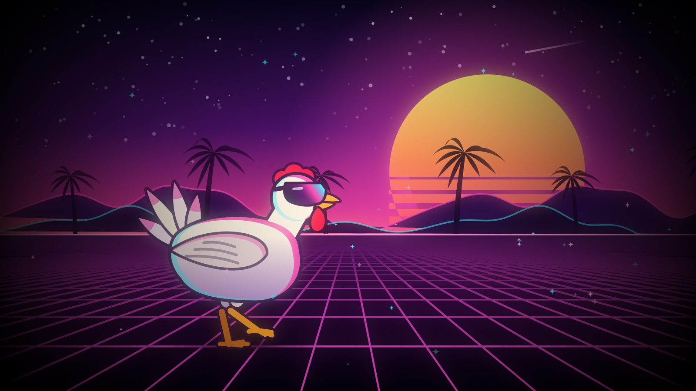

<p align="center">
  
</p>

<h1 align="center">Tidewall</h1>

<p align="center">
  Live, looping video wallpapers for macOS. Turn any video or GIF into a moving desktop.
</p>

<p align="center">
  <a href="https://github.com/TheBEACONFoundation/Tidewall/actions/workflows/ci.yml"></a>
  
  
  <a href="LICENSE"></a>
</p>

<p align="center">
  
</p>

Tidewall is a native SwiftUI + AppKit app in the spirit of Wallpaper Engine. Import a video, trim the part that loops, frame it, color-grade it, and set it as your desktop. It stays out of the way: hardware-decoded playback, click-through windows beneath your desktop icons, and automatic pausing whenever nobody can see it.

## Features

- **Built-in wallpapers**:
  - **Cool Chicken**: a chicken in shades struts through a synthwave sunset, in 4K60.
  - **Aurora**: drifting color fields.

  Both loop seamlessly. Removed ones can be re-added from the **+** menu.
- **Any video or GIF**: MP4, MOV and M4V (H.264, HEVC, ProRes). Animated GIF, PNG, WebP and HEICS files are converted to H.264 on import.
- **Loop editor** with a live preview framed like your display:
  - Filmstrip trimming with draggable in/out points and frame-accurate scrubbing
  - Fill, fit or stretch, plus zoom, position, mirroring and a background color
  - Playback speed from 0.25× to 2×
  - Brightness, contrast, saturation, hue, blur, vignette and tint
  - Optional audio
- **Live edits**: changes save automatically and update the desktop as you drag the sliders.
- **Battery-reactive wallpapers**: a wallpaper can carry one video per battery state (full, normal, under 20%, under 10%, empty) and cross-fades between them as the charge changes. The thresholds match the [Lantern](https://github.com/TheBEACONFoundation/Lantern) desktop battery gauge, so the two change together. See [Wallpaper packages](#wallpaper-packages).
- **Multiple displays**: a different wallpaper on each screen, set from a to-scale map of your display arrangement. Screens showing the same wallpaper share one decoder.
- **Menu bar switcher** with thumbnails and pause/resume (⌥⌘P).
- **Easy on the battery**:
  - Color adjustments are baked into a playback copy, so a styled wallpaper costs no more than a plain video.
  - It pauses when windows cover the desktop, and while the screen is locked, asleep or showing a screen saver.
  - It can also pause in Low Power Mode or on battery. It never keeps the display awake.
  - See [Performance](#performance) for measurements.
- **Matching still** (optional): sets the macOS desktop picture to the loop's first frame, so Mission Control, the lock screen and the desktop after quitting all match.
- Open at login, and an optional Dock icon.

## Install

Download the latest **Tidewall-x.y.z.dmg** from [Releases](https://github.com/TheBEACONFoundation/Tidewall/releases), open it, and drag Tidewall to Applications.

Release builds are not notarized unless the release notes say otherwise, so macOS will block the first launch. To allow it, open **System Settings → Privacy & Security** and click **Open Anyway** next to Tidewall. Or run:

```bash
xattr -dr com.apple.quarantine /Applications/Tidewall.app
```

Requires macOS 15 Sequoia or later, on Apple silicon or Intel.

## Usage

1. Open Tidewall. The built-in **Cool Chicken** and **Aurora** wallpapers are already in your library.
2. Drag videos or GIFs into the window, or press **⌘O**.
3. Hover a wallpaper and click **Set**, or double-click it to open the editor.
4. In the editor, drag the yellow handles to choose the loop. Then adjust the framing and look in the right-hand panel.
5. Use the menu bar icon to switch wallpapers or pause them. Use **Displays** in the sidebar to give each screen its own wallpaper.

Tip: HEVC (H.265) videos use the least power. Clips that start and end on similar frames loop most smoothly.

## Build from source

Requires Xcode 26 or later. SwiftUI's macros ship with Xcode, not the standalone Command Line Tools.

```bash
git clone https://github.com/TheBEACONFoundation/Tidewall.git
cd Tidewall
swift test                      # unit + playback tests
Scripts/build-app.sh            # → build/Tidewall.app (universal, ad-hoc signed)
open build/Tidewall.app
```

For quick iteration, `Scripts/build-app.sh debug` builds for your Mac's architecture only. You can also open `Package.swift` in Xcode. Because the app needs its bundle's Info.plist and resources, run it through the build script.

### Distribution builds

`Scripts/package.sh` builds `dist/Tidewall-<version>.dmg`, a `.zip` and `SHA256SUMS.txt`. The version comes from the latest `v*` git tag. To produce a signed and notarized build, set these first:

```bash
export SIGN_IDENTITY="Developer ID Application: Your Name (TEAMID)"
export NOTARY_PROFILE="tidewall"   # from: xcrun notarytool store-credentials tidewall …
Scripts/package.sh
```

Pushing a tag like `v1.1.0` runs the [Release workflow](.github/workflows/release.yml), which tests, packages and publishes a GitHub Release. If the signing secrets listed at the top of that workflow are configured, it signs and notarizes too.

## Wallpaper packages

A `.tidewall` package is a folder containing a `wallpaper.json` manifest and the videos it names. To import one, double-click it, drop it on the library, or choose it from **+ → Import**. For now, packages carry battery variants:

```json
{
  "name": "Lantern",
  "primary": "normal",
  "battery": { "full": "White.mov", "normal": "Green.mov", "low": "Yellow.mov",
               "critical": "Red.mov", "empty": "Black.mov" }
}
```

Missing states fall back to the `primary` video. All the variants share one set of settings, so trim, speed, framing and adjustments apply to whichever is showing. Tidewall reads the battery's charge and charging state the way Lantern does:
- **Full** at 99.5%.
- **Low**, **critical** and **empty** at 20%, 10% and 1.5% while not charging.
- **Normal** otherwise.

`Scripts/make-lantern.swift` renders the matching wallpaper for Lantern.
- **Where the emblem is:** it measures where Lantern actually draws the emblem, from Lantern's window. It then applies Lantern's own layout: the emblem fills the middle 60% of the window, and it's lifted to make room for the percentage caption.
- **Resolution:** it renders at your display's exact pixel size, so the scene's light sits exactly behind the emblem.
- **Look:** each state uses Lantern's palette and particle behavior for that corps.

```bash
swiftc -O Scripts/make-lantern.swift -o .build/tools/make-lantern
.build/tools/make-lantern --package ~/Desktop/Lantern.tidewall   # about 4 minutes
open -a Tidewall ~/Desktop/Lantern.tidewall
```

Re-render it if you move or resize the emblem, turn Show Percentage on or off, or change displays.

## Performance

A live wallpaper has three costs:
- **Decoding**, which Apple's media engine handles in hardware.
- **Compositing**, because WindowServer redraws the screen for every video frame.
- **Filters**, which apply adjustments to every frame on the GPU.

Tidewall removes the costs it can:

- **Baked adjustments.** A few seconds after you stop editing, the look is encoded once into an HEVC playback copy at the highest quality preset. The desktop then plays that copy with no per-frame filtering. The same pass also downscales videos much larger than your displays, and re-encodes codecs your Mac can't decode in hardware. Trim, speed, framing and audio stay live, so changing them never re-encodes. Copies measure 51–56 dB PSNR against live filtering, which is visually lossless.
- **Pausing when covered.** Every 2 seconds, and on every app or Space switch, Tidewall checks how much of each display's desktop is covered by windows; the check costs about 0.3 ms. At 95% coverage it pauses, removing all three costs. The occlusion check macOS provides only fires at 100%, and the translucent menu bar keeps it from ever reaching that.
- **Muted means silent.** A muted player's audio tracks are disabled, so the audio pipeline and hardware can sleep.

Measured on an M5 Max with `Scripts/benchmark.sh` (median of 3 runs, 4K60 H.264, blur + saturation + vignette):

| | GPU | Tidewall CPU | WindowServer CPU* |
| --- | ---: | ---: | ---: |
| Live filters (v1.0.0) | 27.2% | 28.6% | +10.2% |
| Baked copy (now) | 0.7% | 2.3% | +9.5% |
| Paused while covered (now) | 0.0% | 0.1% | ≈ idle |

\* Change from idle. WindowServer's baseline depends on what else is on screen.

At 1080p the same look went from 20.7% to 1.3% CPU. Frame rate and codec matter much less than you might expect: 30 vs 60 fps and H.264 vs HEVC differed by only 1–2% CPU. So Tidewall keeps the source's frame rate.

## How it works

| Piece | Where |
| --- | --- |
| Borderless, click-through window at `kCGDesktopWindowLevel` on every Space: above the system wallpaper, below desktop icons | [`Engine/DesktopWindow.swift`](Sources/Tidewall/Engine/DesktopWindow.swift) |
| `AVQueuePlayer` + `AVPlayerLooper` for gapless loops of a trimmed range. A Core Image `AVVideoComposition` is installed only while an adjustment is active. | [`Engine/LoopingPlayer.swift`](Sources/Tidewall/Engine/LoopingPlayer.swift) |
| Keeps windows and players in sync with displays, assignments, occlusion, sleep/lock and power state | [`Engine/WallpaperEngine.swift`](Sources/Tidewall/Engine/WallpaperEngine.swift) |
| Framing and filter math shared by the desktop, thumbnails and stills | [`Engine/FramePipeline.swift`](Sources/Tidewall/Engine/FramePipeline.swift) |
| Playback copies: when one helps, what it bakes, and the HEVC export | [`Engine/Rendition.swift`](Sources/Tidewall/Engine/Rendition.swift), [`Model/RenditionManager.swift`](Sources/Tidewall/Model/RenditionManager.swift) |
| Library storage, import and GIF → H.264 conversion | [`Model/`](Sources/Tidewall/Model) |
| Library window, editor, displays, menu bar, settings | [`Views/`](Sources/Tidewall/Views) |

Your library lives in `~/Library/Application Support/Tidewall`, and playback copies are kept in its `Renditions` folder. You can see how much space they use, or delete them, in **Settings → Performance**. Deleting a wallpaper moves its video to the Trash. Preferences and display assignments are stored in the `io.github.thebeaconfoundation.Tidewall` defaults domain.

The app icon and the built-in wallpapers are generated by code:
- [`Scripts/make-icon.swift`](Scripts/make-icon.swift) draws the icon.
- [`Scripts/make-sample.swift`](Scripts/make-sample.swift) renders Aurora.
- [`Scripts/make-chicken.swift`](Scripts/make-chicken.swift) renders Cool Chicken.

Every motion completes a whole number of cycles per loop, so each video repeats seamlessly. In Cool Chicken, the planted foot moves at exactly the ground's speed, so the chicken never skates. To add a built-in, render `Resources/<Name>.mov` and list it in `BuiltInWallpaper.all`.

## Limitations

- WebM and MKV aren't supported, because AVFoundation can't play them. Convert them to MP4 or MOV first.
- Wallpapers are videos only; interactive, web or shader scenes are not supported.
- macOS's own wallpaper still appears in Mission Control unless **Match the macOS wallpaper** is enabled.

## Contributing

Issues and pull requests are welcome. See [CONTRIBUTING.md](CONTRIBUTING.md).

## License

Copyright © 2026 Dominic Acosta.

Tidewall is free software: you can redistribute it and/or modify it under the terms of the [GNU General Public License v3.0](LICENSE) as published by the Free Software Foundation.
